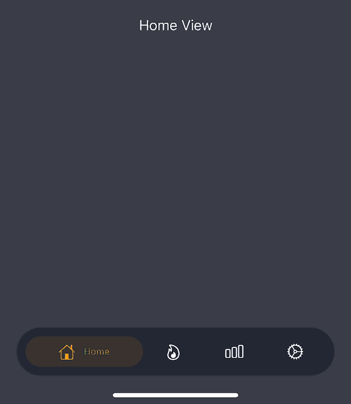

# FloatingTabView



## How to Use:

```swift
let contentView = FloatingTabView(tabs: [
		.init(image: .init(systemName: "house"), title: "Home", selectedColor: Color.orange),
		.init(image: .init(systemName: "flame"), title: "Flame", selectedColor: Color.orange),
		.init(image: .init(systemName: "chart.bar"), title: "Graph", selectedColor: Color.orange),
		.init(image: .init(systemName: "gear"), title: "Settings", selectedColor: Color.orange),
	], content: { selectedTab in
		GeometryReader { geometry in
			if selectedTab == 0 {
				HomeView()
					.frame(width: geometry.size.width, height: geometry.size.height)
			} else if selectedTab == 1 {
				FlameView()
					.frame(width: geometry.size.width, height: geometry.size.height)
			} else if selectedTab == 2 {
				ChartView()
					.frame(width: geometry.size.width, height: geometry.size.height)
			} else if selectedTab == 3 {
				SettingsView()
					.frame(width: geometry.size.width, height: geometry.size.height)
			}
		}
	})
	
window.rootViewController = UIHostingController(rootView: contentView)
```
